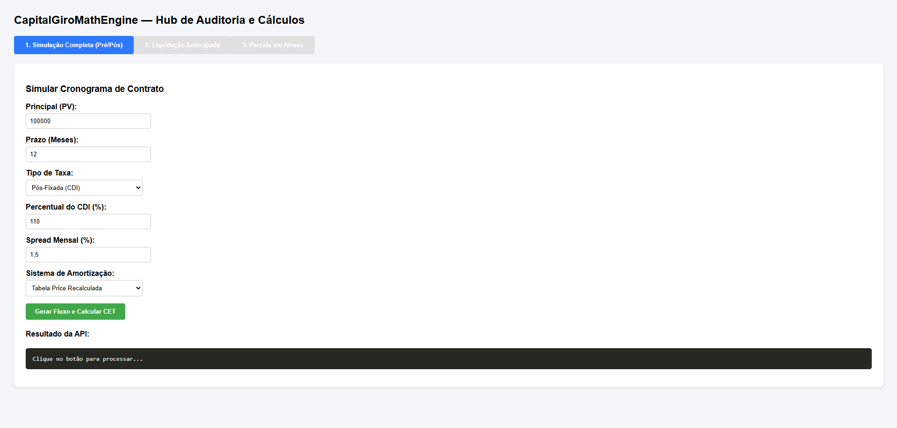
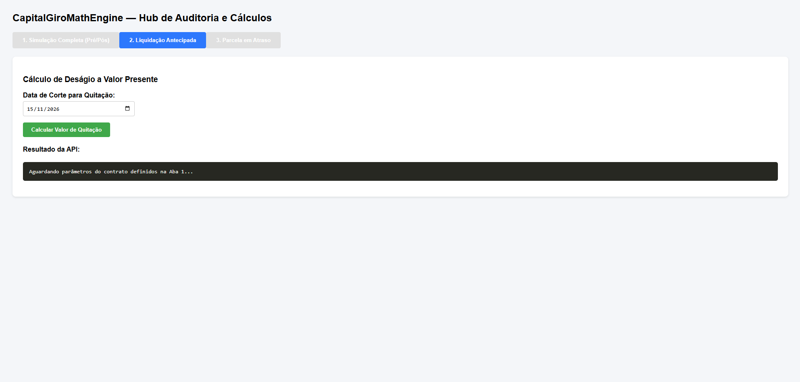
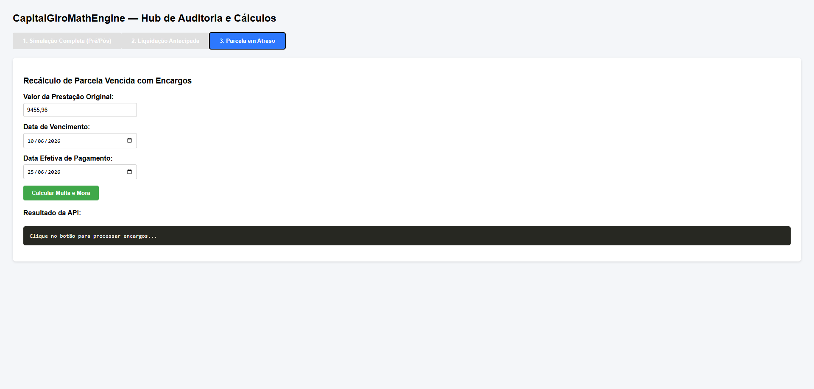

# 🏦 CapitalGiroMathEngine

<div align="center">

**Motor de cálculo financeiro de alta precisão e plataforma de auditoria pericial para contratos de Capital de Giro pré-fixados e pós-fixados em CDI.**

Status do Projeto: 🟢 Live em Produção | Foco: Engenharia de Software Aplicada a Finanças & Perícias Contratuais

| 🚀 Tecnologias Core | 🐳 Container | ⚙️ Arquitetura | 🌐 Link de Produção |
| :---: | :---: | :---: | :---: |
| **Java 21** / **Spring Boot 4.1.0** | **Docker** (Multistage) | **Spring WebFlux** (`WebClient`) | [Acessar Demonstração Online](https://onrender.com) |

</div>

---

## 🎯 O Projeto

O **CapitalGiroMathEngine** afasta a visão puramente acadêmica da matemática financeira e mergulha nas **regras de negócio reais do mercado bancário brasileiro** (convenções da B3, ANBIMA e resoluções do Bacen). 

O sistema foi desenhado para atuar como uma ferramenta de auditoria jurídica e financeira, sendo capaz de reconstruir o saldo devedor de operações corporativas dia a dia útil, eliminando distorções lineares e identificando práticas abusivas ou anatocismo velado.

---

## 🧮 Core Financeiro & Fórmulas Implementadas

### 1. Acúmulo de Juros Pós-Fixados (Convenção Oficial B3)
O motor evita o erro comum de aplicar o percentual do CDI de forma linear sobre o fator diário. O percentual incide diretamente na taxa anualizada antes da extração da raiz de 252 dias úteis:
\[Fd = \left(1 + \frac{CDI_{anual}}{100} \times \frac{\%CDI_{contrato}}{100}\right)^\frac{1}{252}\]

### 2. Equivalência Financeira Dinâmica (Price Recalculada)
Para contratos pós-fixados, o sistema recalcula a prestação a cada período com base no saldo devedor atualizado e no prazo remanescente (m), mitigando riscos de amortização negativa:
\[PMT_k = SD_{k-1} \times \frac{i_k \cdot (1 + i_k)^m}{(1 + i_k)^m - 1}\]

### 3. Custo Efetivo Total (CET) via Algoritmo Numérico
Implementação do método iterativo de **Newton-Raphson** para encontrar a Taxa Interna de Retorno (TIR) exata do fluxo, diferenciando o impacto financeiro real do IOF Financiado vs. IOF Retido na fonte.

---

## ⭐ Funcionalidades Chave

* **Auditoria de Calendário ANBIMA:** Exclusão rigorosa de finais de semana e feriados nacionais bancários. O CDI acumula apenas em dias úteis, e vencimentos em dias não úteis são deslocados sem penalização.
* **Integração Reativa com o BACEN:** Consumo assíncrono via `WebClient` da série histórica do CDI (SGS 12) com armazenamento automático em cache *thread-safe* (`ConcurrentHashMap`).
* **Liquidação Antecipada com Deságio:** Desconto racional composto trazendo as parcelas futuras a valor presente líquido (VP) com base na volatilidade recente do indexador.
* **Mapeamento de Atrasos:** Apuração de mora *pro-rata die* e multa contratual parametrizáveis por contrato.

---

## 🔧 Tecnologias & Arquitetura

* **Backend:** Java 21, Spring Boot 4.1.0, Spring WebFlux (`WebClient`)
* **Processamento Assíncrono:** `@Scheduled` para sincronização diária pós-fechamento do mercado (20:00 BRT)
* **Precisão Numérica:** Uso estrito de `BigDecimal` em toda a camada de serviço para garantir precisão centesimal absoluta.
* **Frontend:** Interface SPA responsiva (HTML5, CSS3, JavaScript Vanilla) servida de forma estática.
* **Ambiente:** Docker (Multistage Build) e Deploy automatizado via Render.

---

## 📸 Capturas de Tela

### Aba 1 – Simulação Completa (Cálculo de Fluxo e CET)


### Aba 2 – Liquidação Antecipada (Deságio a Valor Presente)


### Aba 3 – Parcela em Atraso (Multa e Mora Pro-Rata)


---

## 🌐 Demonstração Online

Acesse a aplicação em produção: **[https://capitalgiromathengine.onrender.com](https://capitalgiromathengine.onrender.com)**

> 💡 *Nota de infraestrutura: Por estar hospedado em um ambiente gratuito (Render Free Tier), o container entra em modo de hibernação após 15 minutos de ociosidade. O primeiro acesso pode demorar cerca de 50 segundos para inicializar a JVM e carregar o cache do CDI.*

---

## 🚀 Execução Local

### Via Maven
```bash
# Clonar o repositório
git clone https://github.com/ErickRocha7/CapitalGiroMathEngine.git
cd CapitalGiroMathEngine

# Compilar e subir o servidor Tomcat local
mvn spring-boot:run
```
Acesse `http://localhost:8080` no navegador.

### Via Docker
```bash
# Construir a imagem a partir do build multi-estágio do Dockerfile
docker build -t capitalgiro-math-engine .

# Executar o container mapeando a porta local
docker run -p 8080:8080 capitalgiro-math-engine
```

---

## 📁 Estrutura de Pastas do Sistema

```text
src/main/java/com/capitalgiromath/capitalgiromathengine/
├── CapitalGiroMathEngineApplication.java     # Classe principal com @EnableScheduling
├── config/
│   └── AppInitializer.java                  # CommandLineRunner para população do cache
├── model/
│   ├── ContratoRequest.java                 # DTO de entrada com dados do empréstimo
│   ├── ParcelaResponse.java                 # Estrutura de dados de retorno da parcela
│   ├── FluxoResponse.java                   # Consolidação do cronograma + cálculo do CET
│   └── ParcelaVencidaRequest.java           # Parâmetros configuráveis para cálculo de mora
├── service/
│   ├── CdiService.java                      # Gerenciador de calendário e cache do BACEN
│   └── CalculoService.java                  # Core dos sistemas SAC, Price e Newton-Raphson
└── controller/
    └── SimulacaoController.java             # Endpoints REST expostos pela API
```

---

## 👤 Autor

* **Erick Rocha** - [LinkedIn]([seu-link-aqui](https://www.linkedin.com/in/erickdelimarocha/)) • [GitHub](https://github.com/ErickRocha7)

---
*Este projeto foi desenvolvido com foco em Engenharia de Software voltada ao Mercado Financeiro e Perícias Contratuais.*
